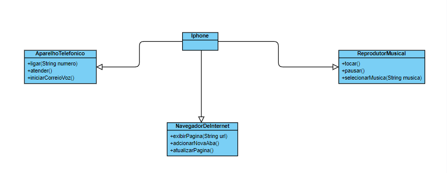
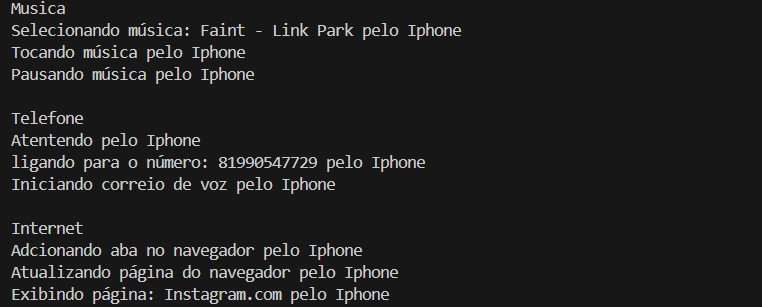

## Iphone POO - DIO Project

Projeto em Java utilizando Programação Orientada a Objetos

Objetivo é fazer o primeiro iphone, com as funções de música, navegador e chamadas.

Abaixo está o UML que foi requisitado também

Imagem final do console após a execução do programa
